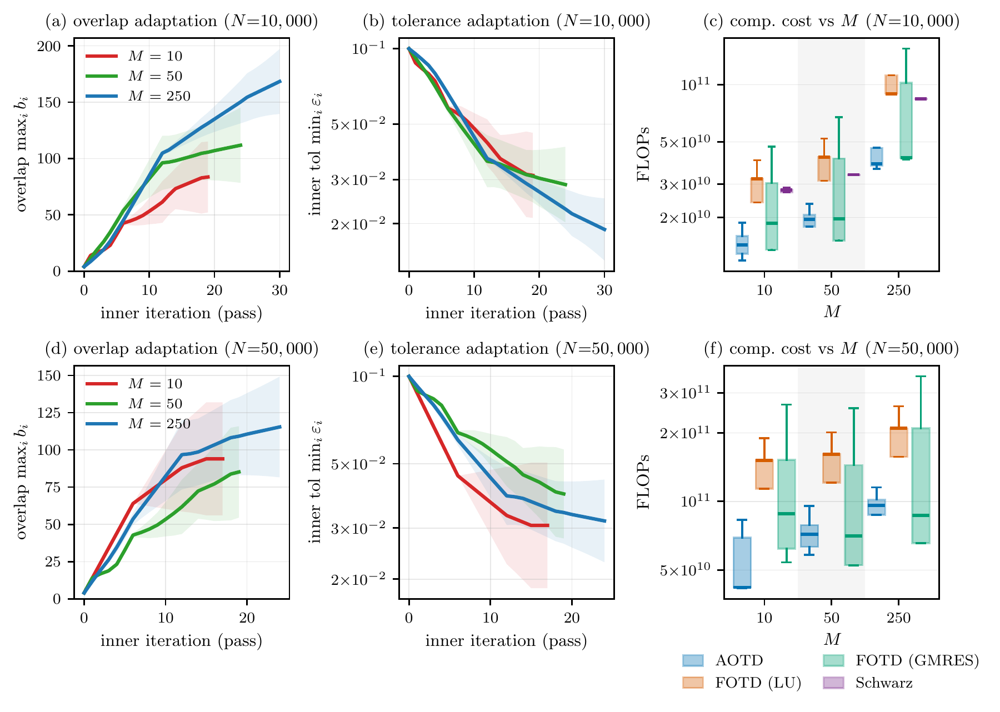

<p align="center">
  <a href="https://ucsd.edu/"></a>
  &nbsp;&nbsp;&nbsp;
  <a href="https://www.gatech.edu/"></a>
  &nbsp;&nbsp;&nbsp;
  <a href="https://www.berkeley.edu/"></a>
</p>

<h1 align="center">Adaptive Overlapping Temporal Decomposition (AOTD)</h1> 



*Burgers PDE control at 10,000 and 50,000 time steps: adaptive overlaps and
local solve tolerances (left, middle), and computational work across methods
(right). Figure 5, using the archived five-seed experiments.*

## About this repository

This repository contains all the code for reproducing the experiments in the paper titled: **An Adaptive, Parallel, and Inexact Newton
Method for Large-scale Nonlinear Optimal Control**. For any issues, or questions please make a Github issue or contact the authors at lbhan@ucsd.edu.

## Getting started

```bash
python -m venv .venv
source .venv/bin/activate
pip install -e .
python experiments.py smoke
```

Plotting also requires LaTeX. On Debian/Ubuntu:

```bash
sudo apt-get install texlive-latex-extra texlive-fonts-recommended cm-super dvipng
```

## Generate data

```bash
python experiments.py run --study swing --workers 1
```

Studies: `swing`, `burgers`, `rates`, `globalization`, or `all`. Data goes to
`results/runs/<study>/`; use `--output` to change the root. Settings are in
`experiments/<study>/run_*.py`. Burgers runs can take hours and tens of GB of RAM.

## Figures and tables

After generating all four studies:

```bash
python experiments.py plot --input results/runs --compile-tables
```

Or use the bundled data without running the solvers:

```bash
python experiments.py plot --archived --compile-tables
```

Outputs go to `results/paper/`. Bundled records are in `data/*.json.gz`.
Plots cover Figures 2–7 and Tables 1, 2, 4, 5, 6; Figure 1 and Table 3 are
manuscript-only material, not experimental outputs.
New runs use a 100-iteration inner cap; archived runs used 120. Use a fresh output
root after changing settings to avoid reusing older records.

Solver code is in `src/newton/`. `python experiments.py --help`
lists all commands, including verification and a quick solver check.

## Citation

Placeholder—publication details will be added before the final release.

```bibtex
@misc{bhan_aotd,
  author = {Bhan, Luke and Mahoney, Michael W. and Na, Sen},
  title = {An Adaptive, Parallel, and Inexact Newton Method for
           Large-scale Nonlinear Optimal Control},
  note = {Citation placeholder: venue, year, and DOI to be added}
}
```

## License

Code is released under the [MIT License](LICENSE). University logos remain the
property of their respective institutions and are not covered by this license;
their display does not imply endorsement. See [asset sources](assets/README.md).
